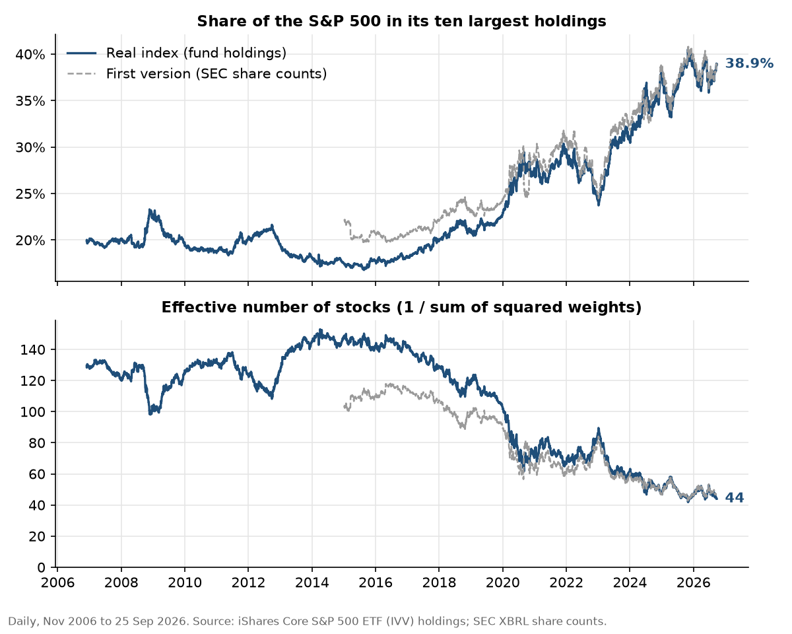
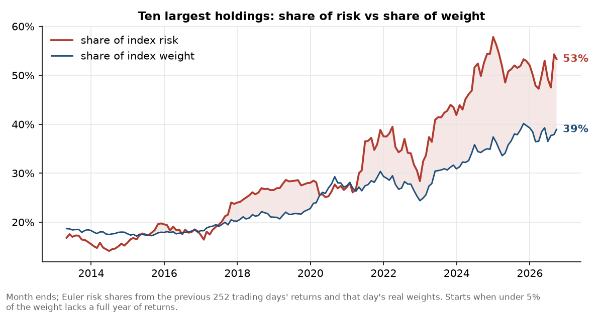
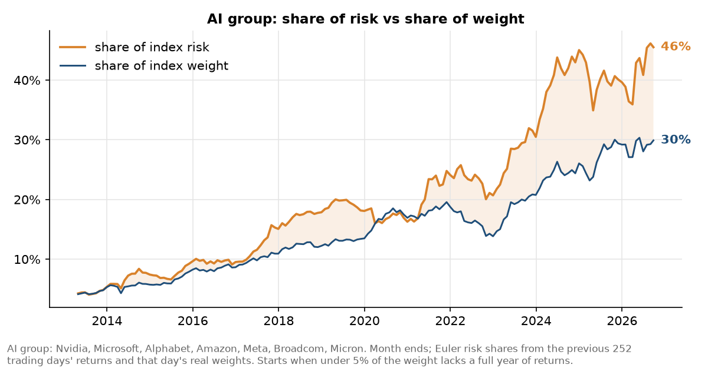

# Is the S&P 500 secretly an AI bet?

If you own an ordinary S&P 500 index fund, how much of your money actually
depends on a handful of AI companies, and what would it cost you if those
companies fell hard?

I built the dataset from scratch to find out. This repository has the whole
pipeline: the real index weights, prices, SEC filings, the risk models, and a
Power BI report, plus one command that updates all of it.

Index weights: every trading day from November 2006 to September 2026, from the
holdings of an index fund that fully replicates the S&P 500. Risk models:
January 2015 to September 2026, 2,951 trading days.

In September 2026 I audited the first version of this project and found that
it had silently left out many companies, among them Meta for seven years. The
numbers below are the corrected ones; [`docs/audit.md`](docs/audit.md) lists
every problem and how much it moved the results.

<!-- numbers:start -->
*Updated 29 Sep 2026 by `update.py`; index holdings to 25 Sep 2026.*

| | Sep 2026 | Jan 2015 |
|---|---|---|
| Ten largest holdings, share of the index | 38.9% | 17.5% |
| Effective number of stocks | 44 | 148 |
| AI group, share of the index | 29.9% | 5.7% |
| Ten largest holdings, share of risk (past 252 trading days) | 53.3% | 16.5% |
| AI group, share of risk (past 252 trading days) | 45.5% | 7.3% |

A 25% fall in the AI group costs an index investor about 16.4% (17.1% with betas from turbulent days); the weights alone suggest 7.5%.
Since January 2015: annualised volatility 17.6%, one-day 97.5% VaR 2.28%, Expected Shortfall 3.45% (S&P 500 total return index).
<!-- numbers:end -->


## What I found

**The index is less than a third as diversified as it was in 2015.** The ten
largest holdings have gone from 17.3% of the index (2015 average) to 38.9%.
Measured by the effective number of stocks, which asks how many equally
weighted holdings would give the same concentration, it has fallen from 145 to
44.



**Those ten holdings now carry 53% of the index's risk on 39% of its weight,
and that gap is new.** Until 2017 they contributed risk roughly in proportion to
their size, or slightly less. The gap opened in 2018 and has widened since
2022. It only shows up if you compute the decomposition rolling through time
rather than as a snapshot.



**The risk is concentrated in semiconductors, not in large companies
generally.** Nvidia, Broadcom, Micron and AMD are 14% of the index and 29% of
its risk (on returns since 2024); Nvidia alone is 8% of the weight and 16% of the risk. Apple and
Microsoft, the two largest non-chip holdings, carry slightly less risk than
their weight.



**A 25% fall in the AI group would cost an index investor 16 to 17%**, not the
7.5% the weights suggest, because the spillover to everything else is larger
than the direct hit. Defensive holdings get more exposed exactly when AI stocks
move sharply: Johnson & Johnson's sensitivity to the AI group rises by about
40% on the days the group moves most.

**Today's weighting costs about 3.3 percentage points of annualised
volatility** compared with an equal-weighted version of the same 500 companies
(17.7% against 14.4%, on 2024 to 2026 returns). Same companies, same return
behaviour, different weights.

**On the fundamentals, capital spending is growing much faster than revenue.**
Over the last three years Microsoft's capex grew 60% a year against revenue
growth of 16%, Alphabet's 43% against 13%, Amazon's 28% against 12%, and Meta's
30% against 20%. Depreciation, the part of that spending that reaches reported
profits each year, is only 29% of this year's capex, so most of the cost has
not hit profits yet. As a group they still pay for it from their own cash flow
($150bn of free cash flow over the last four quarters), though Amazon's is now
negative. Nvidia's revenue equals 57% of what these four spent in 2025, up from
about a fifth before 2023, which is the channel connecting the fundamentals to
the risk findings.

---

## How it was built

```
update.py                 one command: download what is new, rerun everything, redraw
                          the charts, update the numbers at the top of this README
run_all.py                the analysis only, from the raw files to data/bi/*.csv
src/
  00_fetch_data.py          downloads: fund holdings, Yahoo prices, SEC facts, membership
  01_membership.py          index membership history (fja05680/sp500), a cross-check
  02_prices_yf.py           daily prices from yfinance, resumable in batches
  04_prices_tiingo.py       prices from Tiingo for the tickers yfinance missed
  05_holdings.py            the real index weights, from the fund's daily holdings
  06_merge_prices.py        one checked price source per company and day
  07_shares.py              shares outstanding from the SEC XBRL API
  10_merge_manual_shares.py cover-page share counts for companies the API lacks
  08_concentration.py       weights and concentration: real, and rebuilt from SEC counts
  11_validate_spy.py        index returns, and the checks against the real index
  12_risk_l1.py             normality tests, tail counts
  13_risk_l2.py             EWMA and GARCH(1,1)-t volatility
  14_risk_pca.py            PCA on the AI group, raw and market-adjusted
  15_risk_decomp.py         Euler risk decomposition
  16_stress_test.py         shock scenarios, normal and stressed betas
  17_var_es.py              VaR and Expected Shortfall, three methods
  18_backtest.py            Kupiec and Christoffersen tests
  19_rolling_backtest.py    rolling out-of-sample VaR backtest
  20_evt.py                 Generalized Pareto fit to the tail
  21_counterfactual.py      what the current weighting costs
  22_fundamentals.py        SEC financials for the AI group
  23_capex_analysis.py      capex vs revenue, depreciation gap
  25_rolling_risk.py        risk decomposition rolling through time
  24_export_for_bi.py       CSV exports for the Power BI report
  28_charts.py              the charts in this README
reference/
  ticker_aliases.csv        renamed companies and iShares ticker formats (FB -> META)
  manual_shares.csv         share counts checked by hand against the filings
```

Python, SQL and DuckDB. Everything is stored in a single DuckDB file and
queried with SQL. The index weights come from the daily holdings of the iShares
Core S&P 500 ETF (IVV), which holds every member of the index at its index
weight. Prices come from Yahoo Finance and Tiingo, company data from the SEC's
XBRL API. Index-level risk uses the official S&P 500 Total Return index.

Methods: GARCH(1,1) with Student-t errors for conditional volatility,
principal component analysis for the factor structure, Euler decomposition for
splitting index risk between constituents, Extreme Value Theory for the tail,
and rolling out-of-sample backtesting to check the VaR model.

## The dashboard

A five-page Power BI report covering the findings and the methods behind them.
It reads the CSV files in `data/bi`; after running `update.py`, open it and
press Refresh. (The screenshots are from the first version.)


## Does it work?

The most important check is whether the index I work with matches the real
one. Each day I take the previous day's weights, multiply by each company's
return that day, and compare with the official S&P 500 Total Return index.

| Year | S&P 500 TR | Mine | Difference |
|---|---|---|---|
| 2015 | 1.38% | 1.32% | -0.06 |
| 2016 | 11.96% | 12.10% | +0.14 |
| 2017 | 21.83% | 22.07% | +0.24 |
| 2018 | -4.38% | -4.56% | -0.17 |
| 2019 | 31.49% | 31.41% | -0.08 |
| 2020 | 18.40% | 18.32% | -0.08 |
| 2021 | 28.71% | 28.70% | -0.00 |
| 2022 | -18.11% | -18.11% | -0.00 |
| 2023 | 26.29% | 26.33% | +0.04 |
| 2024 | 25.02% | 25.02% | -0.00 |
| 2025 | 17.88% | 17.86% | -0.02 |
| 2026 | 14.09% | 14.09% | -0.00 |

Every year within a quarter of a percentage point, and within 0.04 points since
2021. The larger differences before 2019 come from gaps: the first half of
2017, when the fund's archive has no files and I move the last known weights
with each company's return, and days when a company's return is missing. The first version, built from SEC share counts,
was off by up to 2.4 points a year.

I also had the headline numbers recomputed by a separate script written
without access to this pipeline or its results, straight from the raw files.
Every number agreed (details in [`docs/audit.md`](docs/audit.md)).

The VaR model does **not** pass its backtest. Refitting a GARCH(1,1)-t model
every 20 days on the previous 1,000 days and forecasting one day ahead, so no
prediction uses information that did not exist at the time, it has 3.5%
exceptions at the 97.5% level where 2.5% are expected, and fails the Kupiec
test at 97.5%, 99% and 99.5%. The exceptions are not bunched together
(Christoffersen passes), and the last 250 days are in the Basel green zone. The
first version reported a pass, but its backtest was not running the GARCH
forecast it described.

---

## The data problems, which were most of the work

I had assumed the data would be the easy part. It took most of the project, and
it is the part I learned the most from.

**Ticker symbols get recycled.** When a company is acquired or goes bankrupt,
its symbol is freed up and can be reassigned years later. So asking for a
company that left the index in 1999 can return prices belonging to an unrelated
business. Every price is now checked against the fund's own recorded price on
each day the company was held.

**My two price sources meant opposite things by the word "close".** Tiingo
gives the raw traded price; yfinance gives a price already adjusted for splits.
Merging them without noticing would have put half the companies on a different
scale with no error anywhere. I rebuilt the raw price by multiplying each
yfinance price by every split that happened afterwards.

**One company filed a share count that was wrong by a factor of a million.**
Arthur J. Gallagher reported 189 trillion shares for two quarters in 2020, with
correct figures either side. That single error gave it 99.7% of the index
weight.

**My fix for that broke Nvidia.** A filter comparing each value to the
company's median caught the bad filings but also deleted Nvidia's post-split
share counts, because a 10-for-1 split looks identical to a filing error if you
compare against a long-run median. It took three attempts to write a filter
that caught real errors and left real splits alone.

**And the biggest one I only found in the audit: companies that vanished
without an error.** I matched tickers to SEC company records using the SEC's
list of today's tickers. Every company that later changed its ticker,
re-registered or was acquired got no share count and silently dropped out of
my index: Facebook for seven years, Exxon Mobil until August 2026, Disney
before 2019, and about 200 others. In 2015 almost a third of the index's
members were missing. The fix was to stop rebuilding the weights and take the real ones
from an index fund's published holdings. The SEC rebuild stays in the
repository as a cross-check; from 2024 onwards it comes within a point of the
real weights.

The thing I keep coming back to is that the dangerous errors are not the ones
that crash. They are the ones that produce plausible-looking numbers.

---

## What I would not claim

**The weights are one fund's holdings, not S&P's own index file.** IVV holds
every member at its index weight, and weights taken from its daily holdings
reproduce the index's return with a tracking error of 0.02% a year since 2021,
but it is a fund, not the index.

**Before May 2012 the fund's archive has month-end holdings only**, and there
are no files at all from January to early July 2017. Days in between are
estimated by moving the last known weights with each company's daily return.
Before 2012 returns exist for 70 to 83% of the index (companies that left
before then are missing from the price sources), so the concentration history
before 2012 is approximate. The risk analysis starts in 2015.

**I still do not have the dot-com comparison.** The fund's archive starts in
November 2006.

**The VaR model is optimistic**, as the backtest shows. VaR and Expected
Shortfall from the full-sample model are descriptive, not forecasts.

**The stress tests are linear**, fitted on historical behaviour. Real selloffs
have rising correlations beyond even the stressed-beta adjustment, so the
larger scenarios probably understate the damage.

**Extreme Value Theory gives single-day probabilities only.** A sustained
decline over months is a different thing and I did not model it.

**Nothing here is a prediction.** I have not forecast whether AI stocks will
fall or when. What I measured is exposure: if you own an index fund, how much
of your money rides on one story, and what various shocks would cost you.

---

## Running it

```bash
python -m venv .venv
.venv\Scripts\activate
pip install -r requirements.txt
python update.py
```

`update.py` downloads whatever is new (fund holdings, prices, SEC data), reruns
the whole analysis, redraws the charts and updates the numbers at the top of
this README. `python update.py --no-fetch` reruns the analysis on the data
already downloaded. Afterwards, open the Power BI report and press Refresh.

The SEC requires a user-agent header with a contact email; it is set in
`src/00_fetch_data.py` and `src/07_shares.py`. A Tiingo API key (in the
`TIINGO_API_KEY` environment variable) is only needed to download Tiingo files
that are missing.

Data is not in the repository: Tiingo's licence is personal-use only, and the
price tables are several hundred megabytes. The first run of `update.py`
downloads everything, which takes about 20 minutes.

---

## Files

- [`docs/audit.md`](docs/audit.md): what the audit found, and how much each problem moved the results
- [`limitations.md`](limitations.md): a running log of compromises made along the way
- `docs/charts/`: the charts above, redrawn on every update
- `S&P500 AI Risk.pbix`: the Power BI report
- `src/`, `reference/`, `update.py`, `run_all.py`: the pipeline

---

## What I would do next

The dot-com era. The fund's archive starts in 2006; before that the share
counts would have to come from the cover pages of EDGAR filings, which go back
to the mid-nineties, including for companies that no longer exist.

A better VaR model, since GARCH-t fails its backtest: filtered historical
simulation, or a model that lets the tail change with volatility.

And on the modelling side, a copula to measure whether these stocks crash
together more than correlation implies, and an equal-weighted version of every
concentration finding as a systematic robustness check.
